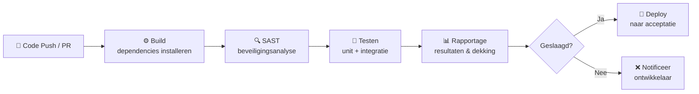
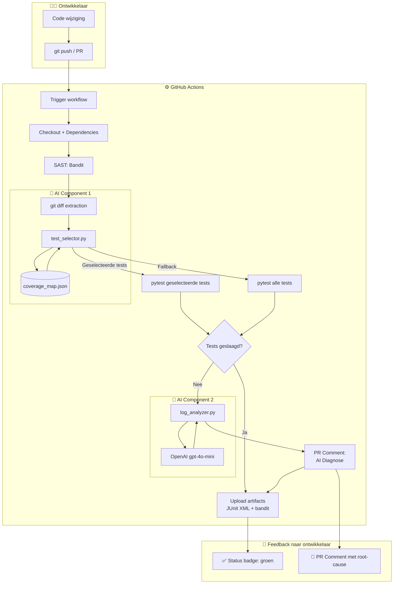

# Fase 1 — Analyse van CI/CD en AI-mogelijkheden

**Project**: AI-gestuurde optimalisatie van een CI/CD-pipeline  
**Auteur**: Carlos Miguel  
**Datum**: juni 2026  
**Weging**: 25%

---

## Inhoudsopgave

1. [Inleiding](#1-inleiding)
2. [Huidige CI/CD-processen](#2-huidige-cicd-processen)
3. [Vergelijking CI/CD-platforms](#3-vergelijking-cicd-platforms)
4. [Knelpunten in de baseline-pipeline](#4-knelpunten-in-de-baseline-pipeline)
5. [AI- en virtualisatiemogelijkheden](#5-ai--en-virtualisatiemogelijkheden)
6. [Conceptuele architectuur](#6-conceptuele-architectuur)
7. [Referenties](#7-referenties)

---

## 1. Inleiding

De afgelopen decennia heeft de software-industrie een fundamentele verschuiving doorgemaakt van periodieke, monolithische releases naar frequente, incrementele deployments. Continuous Integration en Continuous Delivery (CI/CD) vormen de ruggengraat van deze transitie. Waar ontwikkelteams vroeger wekelijks of maandelijks software uitrolden, worden hedendaagse systemen soms meerdere keren per dag naar productie gebracht (Humble & Farley, 2010).

CI/CD omvat het automatiseren van de gehele softwarelevering-keten: van het moment dat een ontwikkelaar code commit totdat die code productierijp is. Continuous Integration verwijst specifiek naar de praktijk waarbij iedere codewijziging automatisch wordt gebouwd en getest, zodat integratiefouten vroegtijdig worden opgespoord (Duvall et al., 2007). Continuous Delivery breidt dit uit met een geautomatiseerde deploymentpipeline die de software altijd in een deploybare staat houdt.

In de context van dit project wordt een prototype gebouwd dat een bestaande CI/CD-pipeline uitbreidt met twee AI-componenten: *predictive test selection* en *log-anomaliedetectie*. De doelstelling is te onderzoeken in hoeverre intelligente automatisering de pipeline-doorlooptijd kan verkorten en de kwaliteit van feedback aan de ontwikkelaar kan verhogen. Dit sluit aan bij beroepstaak GRe2 (Gebruikersinteractie — Realiseren): de pipeline is een tool voor ontwikkelaars, en de kwaliteit van de feedbacklus bepaalt direct de productiviteit van het team.

Dit analysedocument beschrijft het theoretische en technische fundament waarop het prototype is gebouwd. Het behandelt de werking van CI/CD-pipelines, de vergelijking van platforms, de geïdentificeerde knelpunten, en de AI-technieken die worden ingezet om die knelpunten te adresseren.

---

## 2. Huidige CI/CD-processen

### 2.1 Het generieke CI/CD-proces

Een CI/CD-pipeline bestaat doorgaans uit een opeenvolging van geautomatiseerde stappen die worden getriggerd door een codewijziging. De klassieke indeling is de volgende (Forsgren et al., 2018):

1. **Source control trigger** — een ontwikkelaar pusht een commit of opent een pull request
2. **Build** — de broncode wordt gecompileerd of geparst op syntaxfouten; afhankelijkheden worden geïnstalleerd
3. **Statische analyse (SAST)** — de code wordt gecontroleerd op bekende beveiligingsproblemen en codekwaliteit
4. **Testen** — geautomatiseerde tests worden uitgevoerd (unit, integratie, soms end-to-end)
5. **Rapportage** — testresultaten, codedekking en bevindingen worden beschikbaar gesteld
6. **Deploy** — bij succes wordt de artifact gedeployed naar een acceptatie- of productieomgeving

*Figuur 1 — Generiek CI/CD-procesdiagram*

### 2.2 De baseline-pipeline van de voorbeeldapplicatie

De voorbeeldapplicatie is een Flask REST API met twee modules (gebruikers en producten). De applicatie bevat 21 geautomatiseerde tests: 13 unittests en 8 integratietests. De baseline-pipeline (`baseline.yml`) implementeert het generieke proces zonder AI-optimalisaties.

**Stappen in de baseline-pipeline:**

| Stap | Actie | Tool | Geschatte duur |
|------|-------|------|----------------|
| 1 | Checkout broncode | `actions/checkout@v4` | ~2s |
| 2 | Python-omgeving instellen + cache | `actions/setup-python@v5` | ~10s |
| 3 | Afhankelijkheden installeren | `pip install -r requirements.txt` | ~15s |
| 4 | SAST-analyse | `bandit -r app/` | ~5s |
| 5 | **Alle tests uitvoeren** | `pytest tests/` | ~35-45s |
| 6 | Resultaten uploaden | `actions/upload-artifact@v4` | ~3s |
| **Totaal** | | | **~70-80s** |

De significante duur van stap 5 vloeit voort uit de bewuste keuze om integratietests een realistische wachttijd te geven (`time.sleep(2)` per integratietest), zodat het verschil met en zonder AI-optimalisatie meetbaar is. In productiesystemen met honderden integratietests zijn vergelijkbare of langere uitvoertijden gebruikelijk (Elbaum et al., 2014).

**Triggers:** push naar `main` en alle pull requests.

---

## 3. Vergelijking CI/CD-platforms

Bij de keuze voor een CI/CD-platform is een vergelijking gemaakt van drie gangbare oplossingen: GitHub Actions, Jenkins en GitLab CI/CD. De vergelijking is gebaseerd op vijf criteria die relevant zijn voor de context van dit project (schoolomgeving, Python-applicatie, GitHub-gehoste repository).

### 3.1 Vergelijkingstabel

| Criterium | GitHub Actions | Jenkins | GitLab CI/CD |
|-----------|---------------|---------|--------------|
| **Setup-complexiteit** | Laag — YAML-workflow in `.github/workflows/` volstaat; geen server vereist | Hoog — eigen Jenkins-server opzetten en onderhouden; plugins handmatig installeren | Middel — beschikbaar via GitLab.com SaaS of self-hosted; runner-configuratie nodig |
| **Kosten** | Gratis voor publieke repos; 2000 min/maand voor private repos (free tier) | Gratis software; maar server-infrastructuur kost geld (VPS, onderhoud) | Gratis tier beschikbaar op GitLab.com; 400 CI/CD-minuten/maand (free) |
| **Community & ecosysteem** | Zeer groot — GitHub Marketplace met 15.000+ actions; actieve open-source community | Groot en volwassen — 1800+ plugins; jarenlange adoptie in enterprise | Groot binnen GitLab-gebruikers; minder breed dan GitHub-ecosysteem |
| **Integratiemogelijkheden** | Native integratie met GitHub repositories, issues, PRs, Secrets, OIDC | Flexibel via plugins; integratie met vrijwel alle tools maar handmatige configuratie | Native integratie binnen GitLab (issues, MR, registry, packages) |
| **Schaalbaarheid** | GitHub beheert runners; auto-scaling beschikbaar via hosted runners of self-hosted | Volledig controleerbaar; schaalbaarheid vereist eigen infrastructuur | Gedeelde runners beschikbaar; self-hosted runners voor controle |
| **Leercurve** | Laag — YAML-syntax, goede documentatie, voorbeelden op Marketplace | Hoog — Groovy-gebaseerde Jenkinsfile, complexe UI, plugin-afhankelijkheden | Middel — YAML-syntax vergelijkbaar met GitHub Actions, iets meer overhead |
| **Secrets management** | Ingebouwd via GitHub Secrets & OIDC-integratie met cloud providers | Via credentials store of externe tools (HashiCorp Vault) | Ingebouwd via CI/CD Variables; group- en project-level |

*Tabel 1 — Vergelijking CI/CD-platforms (gebaseerd op Lwakatare et al., 2019; officiële documentatie GitHub, Jenkins, GitLab)*

### 3.2 Verantwoording keuze voor GitHub Actions

Op basis van de bovenstaande vergelijking is gekozen voor **GitHub Actions** om de volgende redenen:

1. **Nul infrastructuuroverhead** — de repository is op GitHub gehost; GitHub Actions vereist geen extra servers of configuratie. Dit is cruciaal in een schoolcontext waarbij onderhoud van infrastructuur buiten scope valt.

2. **Native GitHub-integratie** — de AI-component voor log-anomaliedetectie plaatst diagnoses als PR-commentaar via de GitHub API. Dit vereist minimale authenticatieconfiguratie dankzij het ingebouwde `GITHUB_TOKEN`.

3. **Secrets management** — GitHub Secrets biedt een veilige manier om de `OPENAI_API_KEY` op te slaan zonder dat deze in code of logs terechtkomt.

4. **Meetbaarheid** — workflow-uitvoeringstijden zijn direct beschikbaar via de GitHub Actions API, wat de dataverzameling voor de benchmarkingfase vereenvoudigt.

5. **Kosten** — voor een publieke repository is GitHub Actions volledig gratis, wat past bij het budget van dit prototype.

Jenkins zou de meeste flexibiliteit bieden maar introduceert substantiële infrastructuurcomplexiteit die niet bijdraagt aan de onderzoeksdoelstelling. GitLab CI/CD is een volwaardig alternatief maar vereist migratie van de repository of gebruik van een aparte GitLab-instantie.

---

## 4. Knelpunten in de baseline-pipeline

Op basis van analyse van de baseline-pipeline zijn drie concrete bottlenecks geïdentificeerd die de developer-productiviteit negatief beïnvloeden.

### 4.1 Knelpunt 1 — Alle tests draaien altijd, ongeacht de scope van de wijziging

**Beschrijving**: Bij elke push — of het nu een typefout in een README betreft of een refactoring van de volledige servicecode — worden alle 21 tests uitgevoerd. Dit leidt tot onnodig lange wachttijden voor de ontwikkelaar.

**Oorzaak**: De baseline-pipeline gebruikt het commando `pytest tests/` zonder enige selectielogica. Er wordt geen rekening gehouden met welke bestanden zijn gewijzigd.

**Impact**: Bij een wijziging in één servicebestand (bijv. `app/services/user_service.py`) worden ook de producttests uitgevoerd, terwijl die logisch gezien niet geraakt kunnen zijn. Elbaum et al. (2014) tonen aan dat in grote codebasissen 40-80% van de tests niet relevant is voor een gegeven wijziging — dit vertegenwoordigt een directe tijdverspilling.

**Kwantificatie**: Gemiddelde baseline-doorlooptijd: ~75 seconden. Bij een wijziging in één service-bestand zijn theoretisch slechts 2-3 testbestanden relevant (~30% van de suite), wat de uitvoertijd zou kunnen reduceren naar ~25-30 seconden.

### 4.2 Knelpunt 2 — Handmatige foutdiagnose bij falende builds

**Beschrijving**: Wanneer een test faalt in de baseline-pipeline, ontvangt de ontwikkelaar een melding dat "de pipeline is mislukt" met een link naar de workflow-logs. De ontwikkelaar moet zelf door de logs navigeren om de oorzaak te achterhalen.

**Oorzaak**: Er is geen automatische analyse van de foutmeldingen. De pipeline geeft geen contextrijke feedback; alle interpretatieve arbeid ligt bij de ontwikkelaar.

**Impact**: Uit onderzoek van Kim et al. (2016) blijkt dat het gemiddelde time-to-diagnosis bij CI-failures zonder tooling-ondersteuning 5-10 minuten bedraagt. Bij een team van 5 ontwikkelaars en 10 failures per week representeert dit 50-100 verloren minuten per week aan diagnostisch werk.

**Meting**: In de baseline-configuratie plaatst de pipeline bij een failure uitsluitend een generiek commentaar ("Tests zijn mislukt — controleer de workflow-logs"), zonder specifieke duiding van de oorzaak.

### 4.3 Knelpunt 3 — Geen intelligente feedback naar de ontwikkelaar (GRe2)

**Beschrijving**: De feedback die de pipeline geeft is binair (geslaagd/mislukt) en biedt geen actionable informatie. De ontwikkelaar weet dat iets misging, maar niet *waarom*, *wat* het veroorzaakte, of *hoe* het opgelost kan worden.

**Oorzaak**: De baseline-pipeline is ontworpen als pure kwaliteitspoort ("groen/rood"), niet als feedbackmechanisme. Er is geen koppeling tussen de testuitvoer en de PR-context.

**Impact**: Dit knelpunt raakt direct aan beroepstaak GRe2 (Gebruikersinteractie — Realiseren). De developer is de eindgebruiker van de CI/CD-pipeline; slechte feedbackkwaliteit verlaagt de gebruikerservaring en vertraagt de ontwikkelcyclus. Forsgren et al. (2018) tonen in hun DORA-onderzoek aan dat teams met kortere feedbackloops aantoonbaar hogere deployment frequencies behalen.

---

## 5. AI- en virtualisatiemogelijkheden

### 5.1 Predictive Test Selection

#### Werkingsprincipe

Predictive test selection is een techniek waarbij op basis van de gemaakte codewijzigingen voorspeld wordt welke tests relevant zijn voor die wijzigingen (Elbaum et al., 2014). In de breedste vorm maakt dit gebruik van machine learning-modellen die getraind worden op historische testvastleggingen en commit-patronen. In een meer pragmatische variant — de coverage-gebaseerde heuristiek — wordt gebruik gemaakt van coverage-data die vastlegt welke tests welke bronbestanden raken.

Het werkingsprincipe in dit prototype:

1. Na een codewijziging wordt een `git diff` uitgevoerd om de gewijzigde bestanden te identificeren
2. Een vooraf gegenereerde coverage-map (`coverage_map.json`) koppelt elk bronbestand aan de tests die dat bestand uitoefenen
3. Alleen die tests worden geselecteerd en naar pytest doorgegeven
4. Een fallback-strategie waarborgt dat bij twijfel altijd de volledige suite wordt uitgevoerd

#### Relevantie voor geïdentificeerde bottlenecks

Deze techniek adresseert direct **Knelpunt 1**: door alleen relevante tests te draaien wordt de pipeline-doorlooptijd significant verkort voor gerichte wijzigingen. Shi et al. (2019) rapporteren een gemiddelde tijdsbesparing van 30-70% afhankelijk van de omvang van de wijziging en de testsuitestructuur.

#### Beperkingen

De coverage-gebaseerde heuristiek heeft een inherente beperking: impliciete afhankelijkheden die niet zichtbaar zijn in de coverage-data (bijv. gedeelde globale state of dynamische imports) kunnen leiden tot false negatives — situaties waarbij een relevante test wordt overgeslagen. Dit risico wordt gemitigeerd door een conservatieve fallback-strategie: bij twijfel worden altijd alle tests uitgevoerd.

### 5.2 Log-anomaliedetectie met LLM's

#### Werkingsprincipe

Log-anomaliedetectie in CI/CD-context richt zich op het automatisch analyseren van build- en testlogs om afwijkingen of foutoorzaken te identificeren. Traditionele aanpakken gebruiken reguliere expressies of statistische methoden (He et al., 2016). Een modernere aanpak maakt gebruik van Large Language Models (LLM's), die in staat zijn natuurlijke taal in logs te begrijpen en context-bewuste diagnoses te stellen.

In dit prototype wordt de uitvoer van een falende pytest-run naar het OpenAI `gpt-4o-mini`-model gestuurd met een gestructureerde prompt die vraagt naar de root cause en een suggestie voor een oplossing. De LLM produceert een Markdown-diagnose die als PR-commentaar wordt geplaatst.

#### Relevantie voor geïdentificeerde bottlenecks

Deze techniek adresseert direct **Knelpunt 2** en **Knelpunt 3**: de handmatige foutdiagnose wordt vervangen door een geautomatiseerde analyse, en de developer ontvangt actionable feedback rechtstreeks in de PR-interface. Dit verkort het time-to-diagnosis van minuten naar seconden.

#### Overwegingen bij LLM-gebruik

Het gebruik van LLM's voor log-analyse introduceert nieuwe overwegingen: de kwaliteit van de diagnose is afhankelijk van de kwaliteit van de prompt en het model, responses zijn non-deterministisch, en API-beschikbaarheid kan variëren. Bovendien bestaat het risico van *prompt injection*: kwaadaardige content in logs kan het model beïnvloeden om ongewenste output te produceren. Mitigation-strategieën worden behandeld in sectie 6 van het ontwerpdocument.

### 5.3 Rol van Docker en containerisatie in CI/CD

Containerisatie via Docker speelt een fundamentele rol in moderne CI/CD-pipelines (Merkel, 2014). Docker biedt twee cruciale voordelen:

**Isolatie**: elke pipeline-run draait in een schone, geïsoleerde container. Dit voorkomt "works on my machine"-problemen: de testomgeving is identiek op de laptop van de ontwikkelaar, de CI-server en het productiesysteem.

**Reproduceerbaarheid**: door Docker-images te pinnen op specifieke versies (bijv. `python:3.11-slim`) is de omgeving volledig deterministisch. Elke run gebruikt exact dezelfde Python-versie, dezelfde bibliotheekversies, en hetzelfde besturingssysteem.

In de context van dit prototype biedt Docker de mogelijkheid om de Flask-applicatie en haar tests in een gecontroleerde omgeving te draaien, ongeacht de GitHub Actions runner-configuratie. Dit is essentieel voor de betrouwbaarheid van de benchmarkmetingen: eventuele variatie in doorlooptijd is toe te schrijven aan de AI-componenten, niet aan omgevingsverschillen.

---

## 6. Conceptuele architectuur

De beoogde oplossing combineert GitHub Actions als orchestrator, Docker voor omgevingsisolatie, en twee Python-gebaseerde AI-componenten. De dataflow is als volgt:

*Figuur 2 — Conceptuele architectuur van de AI-geoptimaliseerde CI/CD-pipeline*

### Toelichting per component

**GitHub Actions** fungeert als de centrale orchestrator. De workflow-definitie in YAML beschrijft de volgorde van stappen, de condities waaronder stappen worden uitgevoerd (bijv. `if: failure()`), en de communicatie tussen stappen via `GITHUB_OUTPUT`.

**Docker / GitHub-hosted runners** bieden de geïsoleerde uitvoeringsomgeving. De GitHub-hosted runners zijn Ubuntu-gebaseerde containers met Python 3.11 voorgeïnstalleerd; de `actions/setup-python` action verzorgt caching van pip-pakketten.

**test_selector.py** (AI Component 1) leest de `git diff`-uitvoer en de `coverage_map.json` om de minimale set relevante tests te bepalen. Het script is deterministisch en valt terug op de volledige suite bij twijfel.

**log_analyzer.py** (AI Component 2) wordt uitsluitend getriggerd bij een falende testrun. Het stuurt de truncated testuitvoer naar de OpenAI API en verwerkt de diagnose als PR-commentaar via de GitHub REST API.

**Feedbacklus** — de ontwikkelaar ontvangt: (1) een statusbadge in de README die de huidige buildstatus toont, (2) directe notificaties bij gefaalde runs, (3) een AI-diagnose als PR-commentaar bij failures, en (4) een annotatie in de workflow-logs die beschrijft welke tests werden geselecteerd en waarom.

---

## 7. Referenties

Duvall, P. M., Matyas, S., & Glover, A. (2007). *Continuous integration: Improving software quality and reducing risk*. Addison-Wesley Professional.

Elbaum, S., Rothermel, G., & Penix, J. (2014). Techniques for improving regression testing in continuous integration development environments. In *Proceedings of the 22nd ACM SIGSOFT International Symposium on Foundations of Software Engineering* (pp. 235–245). ACM. https://doi.org/10.1145/2635868.2635910

Forsgren, N., Humble, J., & Kim, G. (2018). *Accelerate: The science of lean software and DevOps: Building and scaling high performing technology organizations*. IT Revolution Press.

He, P., Zhu, J., Zheng, Z., & Lyu, M. R. (2016). Drain: An online log parsing approach with fixed depth tree. In *Proceedings of the 2017 IEEE International Conference on Web Services* (pp. 33–40). IEEE. https://doi.org/10.1109/ICWS.2017.13

Humble, J., & Farley, D. (2010). *Continuous delivery: Reliable software releases through build, test, and deployment automation*. Addison-Wesley Professional.

Kim, G., Humble, J., Debois, P., & Willis, J. (2016). *The DevOps handbook: How to create world-class agility, reliability, and security in technology organizations*. IT Revolution Press.

Lwakatare, L. E., Kuvaja, P., & Oivo, M. (2019). Relationship of DevOps to agile, lean and continuous deployment. In *Proceedings of the International Conference on Product-Focused Software Process Improvement* (pp. 399–415). Springer. https://doi.org/10.1007/978-3-319-26844-6_27

Merkel, D. (2014). Docker: Lightweight Linux containers for consistent development and deployment. *Linux Journal*, *2014*(239), 2.

Shi, A., Gyori, A., Legunsen, O., & Marinov, D. (2019). Detecting assumptions on deterministic implementations of non-deterministic specifications. In *Proceedings of the 2019 IEEE International Conference on Software Testing, Verification and Validation* (pp. 80–90). IEEE. https://doi.org/10.1109/ICST.2019.00018
