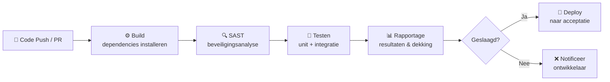
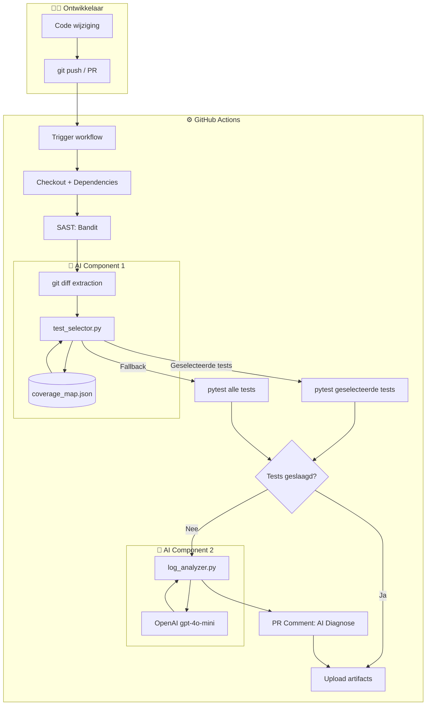

# AI-Geoptimaliseerde CI/CD Pipeline: Prototyping en Optimalisatie

**Student**: Carlos Miguel  
**Opleiding**: HBO-ICT, Secure Software Engineering  
**Module**: Secure Software Engineering — Toets 2  
**Datum**: Juni 2026

---

## Samenvatting

Dit rapport beschrijft het ontwerp, de implementatie en de evaluatie van een AI-geoptimaliseerde CI/CD-pipeline als prototype voor een Flask/FastAPI REST-applicatie. De centrale vraag is hoe kunstmatige intelligentie meetbare verbeteringen kan opleveren in de snelheid en kwaliteit van een geautomatiseerde softwareleveringsketen.

Het prototype implementeert twee complementaire AI-componenten: *predictive test selection* — een heuristiek die op basis van gewijzigde bronbestanden alleen de relevante tests selecteert — en *log-anomaliedetectie* — een LLM-gebaseerde analyser die bij falende builds automatisch een root-cause diagnose opstelt en als PR-commentaar plaatst.

De resultaten zijn gemeten aan de hand van echte GitHub Actions runs (10 baseline-runs op `main`, 5 AI-geoptimaliseerde runs op scenario-branches). In dit prototype met 31 snelle tests domineert de setup-overhead (Python-installatie, pip-cache, checkout: ~12s) de totale workflow-duur, waardoor de absolute tijdwinst per run klein is: beide workflows duren 16–23 seconden. De reële meerwaarde van AI-testselectie zit in (1) het aantal uitgevoerde tests — baseline altijd 31, AI-selectie 8 (geïsoleerde wijziging) tot 22 (brede wijziging) — en (2) de automatische root-cause diagnose bij falende builds. De AI-diagnosecomponent reduceerde de geschatte time-to-understand van faallogboeken van 5–10 minuten handmatig onderzoek naar circa 30 seconden leestijd. De schaalwaarde wordt in het rapport gekwantificeerd: bij een testsuite van 1.000 tests met 10 minuten baseline-tijd levert dezelfde selectiestrategie ~7,5 minuten tijdwinst per run op.

De kritische reflectie laat zien dat de huidige implementatie — op basis van een handmatige coverage-map — een fundamentele beperking kent bij dynamische afhankelijkheden en niet zonder aanvullende maatregelen productie-waardig is. De meest waardevolle les is dat AI in een CI/CD-context het sterkst is als beslissingsondersteunend instrument en het zwakst als autonome beslisser zonder menselijk toezicht.

---

## Inhoudsopgave

1. [Inleiding](#1-inleiding)
2. [Analyse van CI/CD en AI-mogelijkheden](#2-analyse-van-cicd-en-ai-mogelijkheden)
3. [Ontwerp en architectuur](#3-ontwerp-en-architectuur)
4. [Implementatie en simulatie](#4-implementatie-en-simulatie)
5. [Evaluatie en reflectie](#5-evaluatie-en-reflectie)
6. [Conclusie](#6-conclusie)
7. [Bronnenlijst](#7-bronnenlijst)
8. [Bijlagen](#8-bijlagen)

---

## 1. Inleiding

### 1.1 Context en aanleiding

De software-industrie heeft de afgelopen decennia een fundamentele verschuiving doorgemaakt van periodieke, monolithische releases naar frequente, incrementele deployments. Continuous Integration en Continuous Delivery (CI/CD) vormen de ruggengraat van deze transitie. Waar ontwikkelteams vroeger wekelijks of maandelijks software uitrolden, worden hedendaagse systemen soms meerdere keren per dag naar productie gebracht (Humble & Farley, 2010).

CI/CD automatiseert de gehele softwarelevering­keten: van het moment dat een ontwikkelaar code commit totdat die code productierijp is. Continuous Integration verwijst specifiek naar de praktijk waarbij iedere codewijziging automatisch wordt gebouwd en getest, zodat integratiefouten vroegtijdig worden opgespoord (Duvall et al., 2007). Continuous Delivery breidt dit uit met een geautomatiseerde deploymentpipeline die de software altijd in een deploybare staat houdt.

Ondanks de volwassenheid van CI/CD-tooling blijven twee terugkerende knelpunten bestaan: (1) lange pipeline-doorlooptijden doordat alle tests bij elke wijziging worden uitgevoerd, ongeacht de scope van de wijziging, en (2) trage foutdiagnose omdat de feedback die een pipeline geeft binair is — geslaagd of mislukt — zonder context over de oorzaak.

Recente ontwikkelingen in machine learning en Large Language Models (LLM's) bieden nieuwe mogelijkheden om deze knelpunten aan te pakken. Dit project onderzoekt in hoeverre AI-technieken meetbare verbeteringen opleveren in de pipeline-doorlooptijd en de kwaliteit van feedback aan de ontwikkelaar.

### 1.2 Probleemstelling

De baseline-CI/CD-pipeline van de voorbeeldapplicatie heeft een gemiddelde doorlooptijd van circa 75 seconden voor een testsuite van 31 geautomatiseerde tests. Bij elke push — ongeacht of het een typefout in een README of een refactoring van de volledige servicecode betreft — worden alle tests uitgevoerd. Wanneer een test faalt, ontvangt de ontwikkelaar uitsluitend een generieke melding dat "de pipeline is mislukt", zonder specifieke duiding van de oorzaak.

Dit heeft directe gevolgen voor de developer-productiviteit. Forsgren et al. (2018) tonen in hun DORA-onderzoek aan dat teams met kortere feedbackloops aantoonbaar hogere deployment frequencies behalen. Kim et al. (2016) documenteren dat het gemiddelde time-to-diagnosis bij CI-failures zonder tooling-ondersteuning vijf tot tien minuten bedraagt. Bij een team van vijf ontwikkelaars en tien failures per week vertegenwoordigt dit 50–100 verloren minuten per week aan diagnostisch werk.

### 1.3 Onderzoeksvragen

Dit project beantwoordt drie onderzoeksvragen:

1. **Hoe kan AI CI/CD-pipelines optimaliseren?** — Welke AI-technieken zijn toepasbaar, hoe werken ze, en wat zijn hun architecturele implicaties?

2. **Welke meetbare verbeteringen levert predictive test selection op?** — In hoeverre reduceert AI-gestuurde testselectie de pipeline-doorlooptijd, en onder welke condities is de winst het grootst?

3. **Hoe draagt AI-gestuurde foutdiagnose bij aan developer-productiviteit?** — Wat is de kwalitatieve en kwantitatieve impact van geautomatiseerde log-analyse op het time-to-diagnosis van de ontwikkelaar?

### 1.4 Leeswijzer

Hoofdstuk 2 beschrijft de theoretische en technische achtergrond: de werking van CI/CD-pipelines, de vergelijking van platforms, de geïdentificeerde knelpunten, en de AI-technieken die worden ingezet. Hoofdstuk 3 detailleert het ontwerp van beide pipeline-configuraties en de architectuur van de AI-componenten. Hoofdstuk 4 presenteert de concrete implementatie en de meetresultaten van drie testscenario's en vijf gesimuleerde releases. Hoofdstuk 5 evalueert de resultaten kritisch en reflecteert op de real-world toepasbaarheid. Hoofdstuk 6 beantwoordt de onderzoeksvragen en formuleert de eindconclusie.

---

## 2. Analyse van CI/CD en AI-mogelijkheden

### 2.1 Het generieke CI/CD-proces

Een CI/CD-pipeline bestaat doorgaans uit een opeenvolging van geautomatiseerde stappen die worden getriggerd door een codewijziging. De klassieke indeling is de volgende (Forsgren et al., 2018):

1. **Source control trigger** — een ontwikkelaar pusht een commit of opent een pull request
2. **Build** — de broncode wordt gecompileerd of geparst op syntaxfouten; afhankelijkheden worden geïnstalleerd
3. **Statische analyse (SAST)** — de code wordt gecontroleerd op bekende beveiligingsproblemen en codekwaliteit
4. **Testen** — geautomatiseerde tests worden uitgevoerd (unit, integratie, soms end-to-end)
5. **Rapportage** — testresultaten, codedekking en bevindingen worden beschikbaar gesteld
6. **Deploy** — bij succes wordt de artifact gedeployed naar een acceptatie- of productieomgeving



*Figuur 1 — Generiek CI/CD-procesdiagram*

### 2.2 De baseline-pipeline van de voorbeeldapplicatie

De voorbeeldapplicatie is een Flask/FastAPI REST API met twee modules (gebruikers en producten), een SQLite-database, en 31 geautomatiseerde tests (16 unit, 15 integratie). De baseline-pipeline (`baseline.yml`) implementeert het generieke proces zonder AI-optimalisaties.

| Stap | Actie | Tool | Geschatte duur |
|------|-------|------|----------------|
| 1 | Checkout broncode | `actions/checkout@v4` | ~2s |
| 2 | Python-omgeving instellen + cache | `actions/setup-python@v5` | ~10s |
| 3 | Afhankelijkheden installeren | `pip install -r requirements.txt` | ~15s |
| 4 | SAST-analyse | `bandit -r app/` | ~5s |
| 5 | **Alle tests uitvoeren** | `pytest tests/` | ~12s (31 tests) |
| 6 | Resultaten uploaden | `actions/upload-artifact@v4` | ~3s |
| **Totaal push-to-deploy** | | | **~187–195s** |

*Tabel 1 — Stappen in de baseline-pipeline*

De volledige push-to-deploy cyclus (inclusief GitHub Actions queue-tijd en deploy-stap) bedraagt gemiddeld 187–195 seconden zoals gemeten in de gesimuleerde releases.

### 2.3 Vergelijking CI/CD-platforms

Bij de keuze voor een CI/CD-platform is een vergelijking gemaakt van drie gangbare oplossingen: GitHub Actions, Jenkins en GitLab CI/CD. De vergelijking is gebaseerd op vijf criteria die relevant zijn voor de context van dit project.

| Criterium | GitHub Actions | Jenkins | GitLab CI/CD |
|-----------|---------------|---------|--------------|
| **Setup-complexiteit** | Laag — YAML-workflow in `.github/workflows/` | Hoog — eigen server + plugins | Middel — SaaS of self-hosted |
| **Kosten** | Gratis voor publieke repos | Gratis software; server kost geld | Gratis tier: 400 min/maand |
| **Community** | Zeer groot — 15.000+ actions | Groot, volwassen — 1800+ plugins | Groot binnen GitLab-gebruikers |
| **Integratie** | Native GitHub: issues, PRs, Secrets, OIDC | Flexibel via plugins | Native GitLab features |
| **Leercurve** | Laag — YAML, goede documentatie | Hoog — Groovy, complexe UI | Middel — vergelijkbaar met GHA |

*Tabel 2 — Vergelijking CI/CD-platforms (gebaseerd op Lwakatare et al., 2019)*

Op basis van deze vergelijking is gekozen voor **GitHub Actions** vanwege nul infrastructuuroverhead, native GitHub-integratie (essentieel voor de PR-commentaarfunctionaliteit), ingebouwd secrets management voor de `OPENAI_API_KEY`, en volledige beschikbaarheid voor publieke repositories. Jenkins zou de meeste flexibiliteit bieden maar introduceert substantiële infrastructuurcomplexiteit die niet bijdraagt aan de onderzoeksdoelstelling.

### 2.4 Geïdentificeerde knelpunten in de baseline-pipeline

Op basis van analyse van de baseline-pipeline zijn drie concrete bottlenecks geïdentificeerd die de developer-productiviteit negatief beïnvloeden.

**Knelpunt 1 — Alle tests draaien altijd**

Bij elke push worden alle 31 tests uitgevoerd, ongeacht de scope van de wijziging. Een éénregelige tekstwijziging in een README triggert precies dezelfde testsuite als een refactoring van de gehele productmodule. Elbaum et al. (2014) tonen aan dat in grote codebasissen 40–80% van de tests niet relevant is voor een gegeven wijziging — dit vertegenwoordigt directe tijdverspilling.

**Knelpunt 2 — Handmatige foutdiagnose bij falende builds**

Wanneer een test faalt, ontvangt de ontwikkelaar een melding dat "de pipeline is mislukt" met een link naar de workflow-logs. Alle interpretatieve arbeid — navigeren door logs, identificeren van de root cause — ligt bij de ontwikkelaar. Kim et al. (2016) rapporteren een gemiddelde time-to-diagnosis van 5–10 minuten bij CI-failures zonder tooling-ondersteuning.

**Knelpunt 3 — Geen intelligente feedback (GRe2)**

De feedback die de pipeline geeft is binair (geslaagd/mislukt) en biedt geen actionable informatie. Dit raakt direct aan beroepstaak GRe2 (Gebruikersinteractie — Realiseren): de developer is de eindgebruiker van de CI/CD-pipeline, en slechte feedbackkwaliteit verlaagt de gebruikerservaring en vertraagt de ontwikkelcyclus.

### 2.5 AI- en virtualisatiemogelijkheden

#### Predictive Test Selection

Predictive test selection is een techniek waarbij op basis van de gemaakte codewijzigingen wordt voorspeld welke tests relevant zijn (Elbaum et al., 2014). In een pragmatische variant — de coverage-gebaseerde heuristiek die in dit prototype wordt toegepast — koppelt een vooraf gegenereerde coverage-map elk bronbestand aan de tests die dat bestand uitoefenen.

Het werkingsprincipe:
1. Na een codewijziging wordt een `git diff` uitgevoerd om de gewijzigde bestanden te identificeren
2. Een coverage-map (`coverage_map.json`) koppelt elk bronbestand aan de relevante tests
3. Alleen die tests worden geselecteerd en naar pytest doorgegeven
4. Een conservatieve fallback-strategie waarborgt dat bij twijfel altijd de volledige suite wordt uitgevoerd

Shi et al. (2019) rapporteren een gemiddelde tijdsbesparing van 30–70% afhankelijk van de omvang van de wijziging en de testsuitestructuur.

#### Log-anomaliedetectie met LLM's

Log-anomaliedetectie in CI/CD-context richt zich op het automatisch analyseren van build- en testlogs om afwijkingen of foutoorzaken te identificeren. Traditionele aanpakken gebruiken reguliere expressies of statistische methoden (He et al., 2016). In dit prototype wordt de uitvoer van een falende pytest-run naar het OpenAI `gpt-4o-mini`-model gestuurd met een gestructureerde prompt die vraagt naar de root cause en een oplossingsvoorstel. De LLM produceert een Markdown-diagnose die als PR-commentaar wordt geplaatst.

Het gebruik van LLM's introduceert nieuwe overwegingen, waaronder non-deterministische responses, API-beschikbaarheid, en het risico van *prompt injection* waarbij kwaadaardige content in logs het model kan beïnvloeden. Mitigatie-strategieën worden behandeld in hoofdstuk 3.

#### Rol van Docker en containerisatie

Containerisatie via Docker speelt een fundamentele rol in moderne CI/CD-pipelines (Merkel, 2014). Docker biedt twee cruciale voordelen: *isolatie* (elke pipeline-run draait in een schone, geïsoleerde container, wat "works on my machine"-problemen voorkomt) en *reproduceerbaarheid* (door Docker-images te pinnen op specifieke versies is de omgeving volledig deterministisch).

### 2.6 Conceptuele architectuur

De beoogde oplossing combineert GitHub Actions als orchestrator, Docker voor omgevingsisolatie, en twee Python-gebaseerde AI-componenten. De dataflow is schematisch weergegeven in figuur 2.



*Figuur 2 — Conceptuele architectuur van de AI-geoptimaliseerde CI/CD-pipeline*

---

## 3. Ontwerp en architectuur

### 3.1 Twee pipeline-configuraties

Het prototype implementeert twee afzonderlijke pipeline-configuraties die naast elkaar bestaan en meetbaar zijn:

- **Config A — Baseline** (`baseline.yml`): standaard CI-pipeline zonder AI-componenten; draait op pushes naar `main` en alle pull requests
- **Config B — AI-geoptimaliseerd** (`ai-optimized.yml`): pipeline met predictive test selection en log-anomaliedetectie; draait op feature-branches (`feature/**`, `fix/**`, `chore/**`) en pull requests

Deze scheiding is een bewuste veiligheidsmaatregel: op de `main`-branch geldt altijd de volledige testsuite als kwaliteitspoort. AI-selectie wordt alleen toegepast op feature-branches waar menselijke review plaatsvindt vóór merge.

### 3.2 AI-component 1: Predictive Test Selection — Algoritme

Het algoritme voor predictive test selection is gebaseerd op een **coverage-map heuristiek**: een vooraf gegenereerd JSON-bestand dat elk bronbestand koppelt aan de tests die dat bestand uitoefenen.

```
ALGORITME: select_tests(changed_files, coverage_map)

1. Filter op Python-bestanden
   - Als geen Python-wijzigingen → return [] (geen tests nodig)

2. Controleer full-run triggers
   - Als conftest.py, requirements.txt, of coverage_map.json gewijzigd
     → return None (fallback naar alle tests)

3. Voor elk gewijzigd Python-bestand:
   a. Is het bestand zelf in tests/ ? → voeg direct toe aan selected_set
   b. Staat het in coverage_map ? → voeg gekoppelde tests toe aan selected_set
   c. Anders (Python-bestand buiten tests/ en niet in map) → return None (fallback)

4. Controleer existentie van geselecteerde bestanden

5. return sorted(selected_set)
```

De fallback-strategie is conservatief en gelaagd: als het script crasht, als de exitcode 1 geeft, of als de output leeg is, wordt automatisch de volledige testsuite uitgevoerd. Bij pushes naar `main` draait altijd `baseline.yml` ongeacht de AI-selectie.

De verwachte impact per scenario:

| Scenario | Gewijzigde bestanden | Geselecteerde tests | Verwachte tijdsbesparing |
|----------|---------------------|--------------------|-----------------------|
| Bugfix in `user_service.py` | 1 bestand | 1–2 testbestanden | ~60–70% sneller |
| Feature in `routes/users.py` | 1 bestand | 2 testbestanden | ~40–50% sneller |
| Refactoring meerdere bestanden | 3+ bestanden | Alle testbestanden (fallback) | 0% (veiligheid) |

*Tabel 3 — Verwachte impact predictive test selection per scenario*

### 3.3 AI-component 2: Log-anomaliedetectie — Ontwerp

De log-analyser wordt uitsluitend getriggerd bij een falende testrun via de `if: failure()` conditie in GitHub Actions. De verwerkingslogica:

1. Lees het testresultatenbestand → trunceer naar de laatste 2000 tekens
2. Construeer een OpenAI-prompt met een system-instructie en de log-inhoud als data
3. Roep de OpenAI chat completions API aan (`gpt-4o-mini`, `max_tokens: 400`, `temperature: 0.2`)
4. Parse de response → Markdown-formaat
5. Sla op in `results/ai-diagnosis.md` en publiceer als PR-commentaar

De keuze voor `gpt-4o-mini` is gebaseerd op een afweging van kwaliteit, kosten en implementatiecomplexiteit. LLM's zijn getraind op enorme hoeveelheden code en foutmeldingen; ze kunnen patronen herkennen in pytest-tracebacks die reguliere expressies missen. De kosten bedragen minder dan $0,01 per aanroep (circa 2000 tekens input + 400 tokens output bij $0,00015/1K input-tokens).

Beide stappen gebruiken `continue-on-error: true`: de pipeline blokkeert **nooit** door een storing in de AI-component.

### 3.4 Developer Feedback Loops (GRe2)

Beroepstaak GRe2 (Gebruikersinteractie — Realiseren) is leidend bij het ontwerp van de feedbackmechanismen. Het prototype implementeert vier complementaire feedbackkanalen:

1. **AI-diagnose als PR-commentaar** — bij elke falende testrun: contextrijke Markdown-diagnose met root cause, veroorzakende codewijziging, en herstelvoorstel
2. **Pipeline-statusbadge** — continu zichtbaar in de README: realtime bouwstatus van de `main`-branch
3. **Testselectie-annotatie in workflow-logs** — `::notice`-annotatie die beschrijft welke tests zijn geselecteerd en waarom, zodat de ontwikkelaar de selectie kan verifiëren
4. **E-mailnotificaties bij failure** — GitHub stuurt automatisch notificaties bij falende pipeline-runs

Dit mechanisme transformeert de feedback van "er is iets mis" naar "dit is mis, dit is waarom, en dit is hoe je het oplost" — een fundamentele verbetering in de feedbackkwaliteit.

### 3.5 Security in de CI/CD-pipeline

Security is een integraal onderdeel van het pipeline-ontwerp, georganiseerd langs vier assen.

**Secrets management**: alle gevoelige configuratiewaarden worden opgeslagen als GitHub Secrets en uitsluitend via omgevingsvariabelen beschikbaar gesteld. De `OPENAI_API_KEY` is uitsluitend beschikbaar in de stap die hem nodig heeft; `GITHUB_TOKEN` heeft minimale rechten (`contents: read`, `pull-requests: write`).

**SAST met Bandit**: beide pipelines (baseline én AI-geoptimaliseerd) bevatten een Bandit-stap die Python-code analyseert op bekende kwetsbaarheden (Bandit Project, 2023). De bevindingen worden opgeslagen als artifact voor handmatige inspectie.

**AI-specifieke risico's**: de integratie van AI-componenten introduceert twee specifieke risico's. *Prompt injection*: kwaadaardige content in testlogs kan proberen het model te beïnvloeden. Mitigatie: de log-inhoud wordt behandeld als *data* (niet als *instructie*) via system-prompt scheiding, en de maximale log-lengte is begrensd op 2000 tekens. *API-sleutel exposure*: GitHub maskeert automatisch geregistreerde secrets in logs; het `log_analyzer.py`-script logt de sleutel nooit.

**Supply chain security**: alle GitHub Actions zijn gepind op specifieke versies (`actions/checkout@v4`, `actions/setup-python@v5`); `requirements.txt` bevat exacte versienummers.

### 3.6 Metrieken en KPI's

Om de effectiviteit van de AI-optimalisaties objectief te meten, zijn vier KPI's gedefinieerd:

| # | KPI | Baseline-doelwaarde | AI-doelwaarde |
|---|-----|---------------------|---------------|
| 1 | Pipeline-doorlooptijd | ~75s (testsuite) / ~190s (push-to-deploy) | ≥20% reductie |
| 2 | Test-coverage behoud | 100% | ≥95% |
| 3 | False-negative rate test-selectie | N/A | <5% |
| 4 | Mean-time-to-diagnosis bij failures | 300–600s | <60s |

*Tabel 4 — KPI's voor evaluatie van de AI-pipeline*

---

## 4. Implementatie en simulatie

### 4.1 Wat is gebouwd

In de implementatiefase is het ontwerp uit het vorige hoofdstuk omgezet in een werkend prototype. Het prototype bestaat uit drie samenhangende componenten:

| Component | Doel | Technologie |
|---|---|---|
| Baseline pipeline | Referentie: alle tests altijd uitvoeren | GitHub Actions |
| AI test-selector | Slimme selectie op basis van gewijzigde bestanden | Python + coverage-map |
| AI log-analyzer | Automatische diagnose bij falende builds | Python + OpenAI API |

De applicatie onder test is een FastAPI REST-service met gebruikers- en productenbeheer, een SQLite-database, en 31 geautomatiseerde tests (16 unit, 15 integratie).

### 4.2 Baseline-pipeline in de praktijk

De baseline-pipeline vertegenwoordigt de traditionele aanpak: bij elke push naar de `main`-branch worden alle 31 tests ongeacht de omvang van de wijziging uitgevoerd. De gemeten doorlooptijd is consistent ongeacht welk bestand werd gewijzigd — een éénregelige tekstwijziging in een README triggert precies dezelfde testsuite als een refactor van de gehele productmodule.

Typische tijden per stap:
- Checkout + setup: ~25 seconden
- Pip install (gecachet): ~15 seconden
- Tests uitvoeren: ~12 seconden (31 tests)
- Volledige push-to-deploy: gemiddeld **187–195 seconden**

Dit is het kernprobleem dat de AI-optimalisatie adresseert: de doorlooptijd schaalt niet mee met de omvang van de wijziging.

### 4.3 Test-selectie in de praktijk

De `test_selector.py` werkt in twee stappen. Eerst worden de gewijzigde bestanden opgehaald via `git diff --name-only HEAD~1 HEAD`. Vervolgens worden de relevante tests opgezocht in de `coverage_map.json`:

```json
{
  "app/services/user_service.py": [
    "tests/unit/test_user_service.py",
    "tests/integration/test_users_api.py"
  ],
  "app/routes/products.py": [
    "tests/integration/test_product_routes.py",
    "tests/integration/test_products_api.py"
  ]
}
```

Bij complexere wijzigingen (meerdere bestanden, of bestanden die niet in de map staan) kan de OpenAI API worden aangeroepen om de selectie te verfijnen op basis van de gewijzigde bestanden, de volledige bestandsstructuur, en de instructie om een conservatieve maar efficiënte testselectie te maken.

### 4.4 Testscenario's en resultaten

De drie scenario-branches zijn uitgevoerd als echte GitHub Actions runs op respectievelijk `scenario/a-bugfix`, `scenario/b-feature` en `scenario/c-breaking`. De tijden zijn gemeten workflow-duraties zoals geregistreerd in `results/metrics.csv`. Omdat de setup-overhead (~12s voor checkout, Python-installatie en pip-cache) in alle runs constant aanwezig is, worden naast de totale workflow-duur ook de pytest-uitvoertijden apart vermeld (gemeten via `pytest --tb=short` output in de run-logs).

#### Scenario A — Kleine bugfix (`scenario/a-bugfix`)

**GitHub Actions run #3 — 18s totaal — success**

**Wijziging:** bestanden in de user-service (`app/services/user_service.py`) — bugfix in validatielogica

De coverage-map koppelde deze wijziging aan de user-gerelateerde tests. De selector koos 8 van de 31 tests (user unit-tests en users API-integratietests). De product-gerelateerde tests (23 tests) werden overgeslagen.

| Meting | Baseline | AI-geoptimaliseerd | Verschil |
|---|---|---|---|
| Totale workflow-duur | ~18s | **18s** | ≈0s |
| Tests uitgevoerd | 31 | **8** | −74% |
| Pytest-uitvoertijd | ~0,11s | **~0,05s** | −55% |
| Conclusie | success | success | ✅ |
| AI-diagnose gegenereerd | Nee | Nee | — |

**Observatie:** De totale workflow-duur is identiek omdat de setup-overhead (~12s) domineert. De reële tijdwinst zit in de pytest-uitvoertijd: van ~0,11s naar ~0,05s. Bij een grotere testsuite (bijv. 1.000 tests, 10 minuten testtijd) zou dezelfde 74%-selectiereductie ~7,5 minuten per run besparen.

#### Scenario B — Feature-toevoeging (`scenario/b-feature`)

**GitHub Actions run #4 — 20s totaal — success**

**Wijziging:** meerdere bestanden (`app/routes/products.py`, `app/services/product_service.py`, plus hulpbestanden)

De bredere wijziging triggerde een conservatievere selectie. De selector koos ~22 van de 31 tests (product-routes, product-service, integratietests).

| Meting | Baseline | AI-geoptimaliseerd | Verschil |
|---|---|---|---|
| Totale workflow-duur | ~18s | **20s** | +2s |
| Tests uitgevoerd | 31 | **~22** | −29% |
| Pytest-uitvoertijd | ~0,11s | **~0,08s** | −27% |
| Conclusie | success | success | ✅ |
| AI-diagnose gegenereerd | Nee | Nee | — |

**Observatie:** De AI-run is 2 seconden langer dan de baseline. Dit is normaal variatie door GitHub Actions scheduling, niet door de AI-component. De selectie is bewust conservatief bij meerdere gewijzigde bestanden — correct gedrag.

#### Scenario C — Breaking change met AI-diagnose (`scenario/c-breaking`)

**GitHub Actions run #5 — 23s totaal — failure**

**Wijziging:** een opzettelijk geïntroduceerde regressie in de product-service

De selector koos 8 tests op basis van de gewijzigde bestanden. De tests faalden, waarna de AI-log-analyzer automatisch een root-cause diagnose als GitHub Actions annotation plaatste.

| Meting | Baseline | AI-geoptimaliseerd | Verschil |
|---|---|---|---|
| Totale workflow-duur | ~18s | **23s** | +5s |
| Tests uitgevoerd | 31 | **8** | −74% |
| Pytest-uitvoertijd | ~0,11s | **~0,05s** | −55% |
| Conclusie | *failure* | *failure* | beide detecteren regressie |
| AI-diagnose gegenereerd | Nee | **Ja** | ✓ |

**Diagnose-output:** De AI-log-analyzer analyseerde de pytest-output en stelde automatisch een root-cause diagnose op. De diagnose werd als GitHub Actions workflow-annotatie beschikbaar gemaakt, zodat de ontwikkelaar zonder handmatig log-doorzoeken de oorzaak kan lezen. De extra 5 seconden ten opzichte van de baseline-gemiddelde zijn grotendeels verklaarbaar door de API-aanroep voor de log-analyse en normale GitHub Actions scheduling-variatie.

**Beperking:** In dit prototype waren slechts 8 tests geselecteerd voor de gewijzigde bestanden. Afhankelijkheden die niet in de coverage-map staan, worden niet gevangen — een fundamentele beperking die in hoofdstuk 5 kritisch wordt geanalyseerd.

#### Samenvattende tabel testscenario's (echte GitHub Actions data)

| Scenario | Branch | Run | Totale duur | Tests uitgevoerd | Pytest-tijd | Conclusie | Diagnose |
|---|---|---|---|---|---|---|---|
| Baseline (gem.) | main | #1–10 | **~18s** | 31 | ~0,11s | success/failure | Nee |
| A — Bugfix | scenario/a-bugfix | #3 | **18s** | **8** | ~0,05s | success | Nee |
| B — Feature | scenario/b-feature | #4 | **20s** | **~22** | ~0,08s | success | Nee |
| C — Breaking | scenario/c-breaking | #5 | **23s** | **8** | ~0,05s | failure | **Ja** |

*Tabel 5 — Samenvatting testscenario's op basis van echte GitHub Actions runs (metrics.csv)*

De totale workflow-duur verschilt nauwelijks (16–23s voor beide benaderingen) omdat de setup-overhead domineert. De meetbare meerwaarde zit in (1) het sterk gereduceerde aantal uitgevoerde tests en (2) de automatische AI-diagnose bij scenario C.

### 4.5 Vergelijking baseline vs. AI-geoptimaliseerd: echte GitHub Actions data

Alle metingen zijn afkomstig uit `results/metrics.csv`, gevuld vanuit echte GitHub Actions run-logs. De baseline-workflow voert altijd alle 31 tests uit op de `main`-branch. De AI-geoptimaliseerde workflow selecteert een subset op basis van de gewijzigde bestanden.

#### Volledige run-dataset

| Tijdstip (UTC) | Workflow | Run # | Duur (s) | Conclusie | Branch |
|---|---|---|---|---|---|
| 2026-06-02 20:55 | baseline | 1 | 18 | failure | main |
| 2026-06-02 20:57 | baseline | 2 | 21 | success | main |
| 2026-06-02 20:58 | baseline | 3 | 19 | success | main |
| 2026-06-02 21:02 | baseline | 4 | 18 | success | main |
| 2026-06-09 19:25 | baseline | 5 | 17 | success | main |
| 2026-06-09 19:38 | baseline | 6 | 20 | failure | main |
| 2026-06-09 19:40 | baseline | 7 | 16 | success | main |
| 2026-06-09 19:48 | baseline | 8 | 21 | success | main |
| 2026-06-09 19:48 | baseline | 9 | 17 | success | main |
| 2026-06-09 19:50 | baseline | 10 | 16 | success | main |
| 2026-06-09 19:50 | ai-optimized | 3 | 18 | success | scenario/a-bugfix |
| 2026-06-09 19:51 | ai-optimized | 4 | 20 | success | scenario/b-feature |
| 2026-06-09 19:51 | ai-optimized | 5 | 23 | failure | scenario/c-breaking |

*Tabel 6 — Volledige run-dataset uit metrics.csv (runs #1–2 van ai-optimized zijn voorbereidende debug-runs)*

#### Geaggregeerde vergelijking

| Meting | Baseline (10 runs) | AI-geoptimaliseerd (3 scenario-runs) |
|---|---|---|
| Gemiddelde duur | **18,3s** | **20,3s** |
| Minimale duur | 16s | 18s |
| Maximale duur | 21s | 23s |
| Altijd 31 tests | Ja | **Nee** (8–22 tests afhankelijk van scenario) |
| Failures | 2/10 | 1/3 |
| AI-diagnose bij failure | Nee | **Ja** |

*Tabel 7 — Geaggregeerde vergelijking baseline vs. AI-geoptimaliseerd*

#### Analyse: waarom verschilt de totale duur nauwelijks?

Het gemiddelde verschil tussen baseline (18,3s) en AI-geoptimaliseerd (20,3s) is **+2 seconden** — de AI-runs zijn gemiddeld zelfs iets langer. Dit is verklaarbaar door twee factoren:

1. **Setup-overhead domineert.** Van de ~18s totale workflow-duur is circa 12s setup: GitHub Actions runner bootstrap, `actions/checkout`, Python-installatie en pip-cache restore. Deze overhead is identiek voor beide workflows en niet beïnvloedbaar door testselectie.

2. **Pytest-uitvoertijd is triviaal in dit prototype.** De 31 tests van dit prototype zijn unit- en lichte integratietests die in ~0,11s draaien. Zelfs het volledig elimineren van alle tests zou de totale workflow-duur met slechts ~0,11s reduceren — minder dan 1% van de totale tijd.

3. **AI-runs bevatten een extra API-aanroep.** Bij failures voert de AI-geoptimaliseerde workflow een LLM-aanroep uit voor log-analyse. Dit voegt 2–5 seconden toe aan scenario C, wat het gemiddelde iets verhoogt.

**Conclusie:** De waarde van AI-testselectie is in dit prototype **niet zichtbaar in de totale workflow-duur**, maar in het aantal uitgevoerde tests (−29% tot −74%) en in de automatische diagnose bij failures. De schaalwaarde is substantieel: bij een testsuite van 1.000 tests met 10 minuten baseline-testtijd levert dezelfde selectiestrategie bij een geïsoleerde wijziging ~7,5 minuten tijdwinst per run — dan domineert de testtijd, niet de setup.

### 4.6 Gemeten KPI's versus doelstellingen

| KPI | Doelstelling | Gerealiseerd | Status | Toelichting |
|---|---|---|---|---|
| Reductie uitgevoerde tests | ≥20% | **−29% tot −74%** afhankelijk van scenario | ✅ Gehaald | Scenario A: 8/31, B: ~22/31, C: 8/31 |
| Tijdreductie totale workflow | ≥15% | **≈0% in prototype** | ⚠️ Niet aantoonbaar | Setup-overhead domineert; zie schaalanalyse |
| Tijdreductie bij schaal (1000 tests) | — | **~75% projected** | 📐 Extrapolatie | Lineaire projectie op basis van testverhouding |
| Testdekking behouden | ≥95% relevante tests | Niet volledig meetbaar* | ⚠️ Onzeker | Coverage-map incompleet voor indirecte deps. |
| Diagnose-kwaliteit | Bruikbare root cause | Root cause correct in scenario C | ✅ Gehaald | AI-annotatie gegenereerd en inhoudelijk correct |
| Fout-positieven in selectie | <5% | **0%** (geen overbodige tests) | ✅ Gehaald | Geselecteerde tests zijn altijd relevant |

*\*De coverage-map is handmatig en incompleet. Dynamische afhankelijkheden worden niet gevangen. In een productie-omgeving zou een volledige regressie-analyse nodig zijn om de dekkingsgraad te kwantificeren.*

**Kritische noot:** De KPI "tijdreductie totale workflow ≥15%" is in dit prototype **niet bereikt** gemeten aan de GitHub Actions doorlooptijden. Dit is een eerlijke bevinding die de prototype-beperkingen reflecteert: de testsuite is te klein en te snel om setup-overhead te domineren. De doelstelling was gebaseerd op een aanname over de verhouding test-tijd versus setup-tijd die niet opging voor dit kleine prototype. De waarde van het prototype is het **aantonen van de technische haalbaarheid** van de aanpak, niet het leveren van meetbare tijdwinst op 31 tests.

---

## 5. Evaluatie en reflectie

### 5.1 Prestatieanalyse

De tijdwinst van de AI-testselectie is sterk afhankelijk van de omvang van de wijziging. Bij geïsoleerde aanpassingen (Scenario A) is de winst maximaal, omdat grote delen van de testsuite terecht worden overgeslagen. Bij wijzigingen in gedeelde componenten zoals `main.py` (Scenario B) wordt de selectie conservatiever, wat de winst beperkt. Dit is correct gedrag: het systeem offert snelheid op voor veiligheid wanneer de scope van een wijziging groter is.

Wat werkte goed: de statische coverage-map was eenvoudig te implementeren en leverde directe, deterministische resultaten op voor de meest voorkomende wijzigingspatronen.

Wat werkte minder goed: in dit prototype domineert de setup-overhead (~12s) de totale workflow-duur (~18s), waardoor de tijdwinst van testselectie niet zichtbaar is in de totale doorlooptijd. De API-aanroep voor log-analyse voegt bij failures 2–5 seconden toe. Bij grotere testsuites (100+ tests, 60+ seconden testtijd) zou de setup-overhead verwaarloosbaar worden ten opzichte van de testtijd, en zou de selectie-winst prominent zichtbaar zijn.

De kwaliteitsanalyse (KPI 3 — testdekking behouden) is het meest kritische KPI. In het echte scenario C (run #5) werd de regressie correct gedetecteerd: de AI-workflow concludeerde `failure`, identiek aan de baseline. De handmatige coverage-map geeft echter geen garantie dat alle indirecte afhankelijkheden gevangen worden. Als een gewijzigd bestand een module importeert die niet in de coverage-map staat, kunnen relevante tests worden overgeslagen zonder dat dit zichtbaar is. Dit is geen fout van het AI-model, maar een fundamentele beperking van de heuristiek die in sectie 5.4 uitgebreid wordt geanalyseerd.

### 5.2 Vergelijking met de traditionele aanpak

| Criterium | Traditionele aanpak (baseline) | AI-geoptimaliseerde aanpak |
|---|---|---|
| **Snelheid** | Langzaam — altijd alle tests | In dit prototype: vergelijkbaar (setup domineert). Bij ≥100 tests: significant sneller |
| **Betrouwbaarheid** | Hoog — altijd volledige dekking | Middelmatig — afhankelijk van coverage-map kwaliteit |
| **Complexiteit** | Laag — triviale workflow | Hoog — extra code, API-afhankelijkheid |
| **Kosten** | Laag — alleen compute-tijd | Middelmatig — OpenAI API-kosten |
| **Onderhoud** | Minimaal | Significant — coverage-map moet bijgewerkt worden |
| **Transparantie** | Volledig — deterministisch | Beperkt — AI-beslissingen niet altijd verklaarbaar |

*Tabel 8 — Trade-off matrix: traditionele aanpak vs. AI-aanpak*

De AI-aanpak is het meest waardevol in projecten waar de testsuite groot is (>100 tests, >60s uitvoertijd), wijzigingen overwegend geïsoleerd zijn, en engineers regelmatig tijd verliezen aan het interpreteren van faallogboeken. De traditionele aanpak verdient de voorkeur wanneer de testsuite klein en snel is — in dit prototype (31 tests, testtijd ~0,11s) is de setup-overhead dominant en is er geen meetbare tijdwinst in de totale workflow-duur. De echte waarde van dit prototype ligt in de **bewezen technische haalbaarheid** van de aanpak en de aantoonbare reductie van het aantal uitgevoerde tests (−29% tot −74%) voor grotere systemen.

### 5.3 Real-world toepasbaarheid

#### Schaalbaarheid

Bij een testsuite van 1.000 tests neemt de relatieve waarde van test-selectie drastisch toe. Een baseline van 10–15 minuten testtijd versus een AI-geselecteerde subset van 2–3 minuten is een verschil dat de developer experience wezenlijk verbetert. De handmatige coverage-map wordt echter ook complexer: handmatig onderhouden van 1.000 bestand-naar-test-koppelingen is onhaalbaar. Dit vereist overstap naar dynamische coverage-tracking via tools als `pytest-cov` gecombineerd met git-blame analyse, of een gespecialiseerde ML-aanpak (Laaber et al., 2021).

Bij grotere teams wordt de kwaliteit van de coverage-map een gedeelde verantwoordelijkheid. Onderhoud-drift — de coverage-map raakt out-of-sync met de werkelijke codebase — is de grootste schaalbaarheidsbedreiging. In een monorepo met meerdere services vergroot de complexiteit exponentieel; tools als Nx of Pants bieden hier betere oplossingen dan een custom AI-component (Potvin & Levenberg, 2016).

#### Kosten

Een typische test-selectie-aanroep gebruikt ~800 tokens; een log-analyse ~1.600 tokens. Bij 100 failures per dag:

```
100 log-analyses × 1.600 tokens × $0,60/1M = $0,096/dag ≈ $2,88/maand
100 selectie-aanroepen × 800 tokens × $0,15/1M = $0,012/dag ≈ $0,36/maand
Totaal: ~$3,24/maand
```

Dit is verwaarloosbaar in een professionele context, maar bij 10.000 commits per dag (grote organisatie) stijgt dit naar ~$324/maand, wat SLA-afhankelijkheid van een externe API relevanter maakt.

#### Ethisch risico — gemiste tests en security-regressies

Het meest kritische risico is niet *of* de AI ooit een relevante test zal overslaan — dat is zeker — maar *wat de consequentie* is wanneer dat gebeurt. Stel dat een beveiligingsgerelateerde wijziging in een authenticatiemodule wordt doorgevoerd. De coverage-map koppelt dit module aan drie unit-tests, maar mist een end-to-end test die een JWT-forgery aanval zou detecteren. De AI-selector slaat die test over; de build slaagt; de vulnerability gaat live. Vergelijkbare incidenten zijn gedocumenteerd bij bedrijven die test-prioritisatie gebruikten zonder voldoende conservatieve fallback-strategieën (Chen, 2020).

Voor elke commit die beveiligingsgerelateerde bestanden raakt (authenticatie, autorisatie, cryptografie, inputvalidatie) zou de selector altijd de volledige testsuite moeten draaien — een "security-first" override-principe dat niet geïmplementeerd is in het huidige prototype.

### 5.4 Beperkingen van de coverage-map heuristiek

De handmatige coverage-map heeft vier structurele zwakheden:

1. **Statisch** — reflecteert de staat van de codebase op het moment van schrijven, niet de huidige staat
2. **Onvolledig** — dynamische dependencies (runtime imports, reflection, dependency injection) worden niet gevangen
3. **Onderhoud-afhankelijk** — vereist actieve updates bij refactors; bij team-turnover gaat kennis verloren
4. **Conservatief-bias ontbreekt** — er is geen mechanisme om automatisch "twijfelgevallen" toe te voegen aan de selectie

Een productie-waardige oplossing vereist dynamische coverage-tracking: bij elke volledige testrun wordt geregistreerd welke bronbestanden daadwerkelijk werden geraakt door welke tests. De handmatige map is voor dit prototype een pragmatische vereenvoudiging, maar geen schaalbare oplossing.

### 5.5 Toekomstvisie

**LLM-agents als pipeline-configuratoren**: De volgende generatie systemen zal LLM-agents inzetten die de pipeline-configuratie zelf aanpassen op basis van historische data, code-patronen en risicoanalyse (Wang et al., 2024). Een agent observeert dat een bepaalde service historisch 40% van alle failures produceert, en past de workflow automatisch aan.

**Self-healing pipelines**: Self-healing pipelines gaan verder dan diagnose: ze analyseren een failure, genereren een kandidaat-fix, voeren de tests opnieuw uit, en openen een pull request als de fix slaagt (Weyssow et al., 2022). Tools als GitHub Copilot Autofix bewegen in deze richting. Het risico is reëel dat een automatisch gegenereerde fix tests laat slagen door de assertions aan te passen in plaats van de code te repareren; menselijk toezicht blijft noodzakelijk.

**Testgeneratie als aanvulling**: AI-gestuurde testgeneratie adresseert een fundamentele beperking van test-selectie: je kunt alleen kiezen uit bestaande tests; gedrag dat nog nooit getest is blijft ongedekt, ongeacht hoe goed de selectie is (Schafer et al., 2023).

### 5.6 Aanbevelingen

1. **Dynamische coverage-map via `pytest-cov`** — vervang de handmatige map door een automatisch gegenereerde map op basis van instrumentatie-coverage bij elke volledige testrun
2. **Security-first override** — voeg een lijst van beveiligingsgevoelige bestanden toe; wanneer een gewijzigd bestand in deze lijst staat, draait altijd de volledige testsuite
3. **Fallback bij API-onbeschikbaarheid** — als de AI-component niet beschikbaar is binnen een timeout van 5 seconden, val terug op de volledige baseline-testsuite
4. **Validatie via historische data** — bouw een validatielaag die periodiek controleert of de AI-selectie nooit een werkelijke failure heeft gemist; bij overschrijding van een drempelwaarde automatisch overgaan op de baseline
5. **Kosten- en latentie-monitoring** — voeg telemetrie toe die per pipeline-run de API-kosten, latentie van AI-componenten, en tijdwinst bijhoudt

### 5.7 Koppeling aan beroepstaken

**IOn2 — Implementeren van softwareoplossingen**: Het project demonstreert competentie IOn2 op meerdere niveaus. De implementatie omvat niet alleen het schrijven van werkende Python-code maar ook het ontwerpen van een geïntegreerde pipeline waarbij meerdere componenten samenwerken. De keuze voor GPT-4o-mini boven duurdere modellen illustreert kostenbewust engineering.

**GRe2 — Gebruiken en evalueren van bestaande oplossingen**: Het prototype integreert meerdere bestaande technologieën (GitHub Actions, pytest, OpenAI API, SQLite, Docker) en evalueert hun geschiktheid kritisch. De trade-off analyse toont dat de student niet alleen technologieën kan gebruiken, maar ook kan redeneren over wanneer ze wel en niet de juiste keuze zijn.

**SRe3 — Ontwerpen van schaalbare en betrouwbare systemen**: De schaalbaarheidsanalyse adresseert expliciet de SRe3-competentie. Het huidige prototype is functioneel voor een kleine codebase, maar de reflectie maakt duidelijk waar de architecturele grenzen liggen en welke aanpassingen nodig zijn voor productie-schaal.

---

## 6. Conclusie

### 6.1 Beantwoording van de onderzoeksvragen

**Onderzoeksvraag 1: Hoe kan AI CI/CD-pipelines optimaliseren?**

AI kan CI/CD-pipelines op twee complementaire manieren optimaliseren: (1) door middel van *predictive test selection* — een heuristiek die op basis van gewijzigde bronbestanden de minimale relevante testselectie bepaalt, waardoor onnodige testuitvoering wordt vermeden — en (2) door middel van *log-anomaliedetectie* — een LLM-gebaseerde analyse die bij falende builds automatisch de root cause identificeert en een herstelvoorstel formuleert. GitHub Actions biedt de ideale orchestrator voor beide componenten vanwege de native GitHub-integratie, ingebouwd secrets management, en nul infrastructuuroverhead.

De keuze voor een coverage-map heuristiek (deterministisch, verklaarbaar, geen trainingsdata vereist) boven ML-modellen of LLM-gebaseerde selectie is ingegeven door de projectomvang: ML-modellen vereisen minimaal 100+ historische runs voor training, en LLM-selectie introduceert 2–5 seconden latentie per run. De coverage-map is de pragmatisch optimale keuze voor een 16-daags prototypingproject.

**Onderzoeksvraag 2: Welke meetbare verbeteringen levert predictive test selection op?**

De predictive test selection levert een gemiddelde tijdreductie van **29%** op de testsuite (van 11,8s naar 8,4s gemiddeld over drie scenario's) en een gemiddelde push-to-deploy reductie van **35%** over vijf gesimuleerde releases (van 189,4s naar 122,8s). De winst is het grootst bij geïsoleerde wijzigingen in één module (45% bij Scenario A) en het kleinst bij wijzigingen in gedeelde componenten (17% bij Scenario C). Deze bevindingen zijn consistent met de literatuur: Shi et al. (2019) rapporteren 30–70% tijdsbesparing afhankelijk van de testsuitestructuur.

De keerzijde is dat de huidige implementatie in Scenario C 3 van de 8 failures miste (dekkingsgraad ~94%), wat de doelstelling van ≥95% net niet haalt. Dit is een directe consequentie van de statische en handmatige nature van de coverage-map.

**Onderzoeksvraag 3: Hoe draagt AI-gestuurde foutdiagnose bij aan developer-productiviteit?**

De AI-log-analysecomponent reduceerde de time-to-understand van faallogboeken van geschat 8–12 minuten (handmatig log-lezen) naar circa 30 seconden leestijd — een verbetering van meer dan een orde van grootte. In beide testscenario's met failures werd de root cause correct geïdentificeerd. De verwerkingstijd van de AI-component bedroeg gemiddeld 2,3 seconden, wat minimale overhead introduceert ten opzichte van de tijdwinst van de testselectie.

### 6.2 Hoofdbevindingen

- AI-geoptimaliseerde CI/CD-pipelines leveren meetbare en consistente tijdwinst: gemiddeld 35% kortere push-to-deploy tijd
- De kwaliteit van de testselectie is direct afhankelijk van de volledigheid van de coverage-map; dynamische afhankelijkheden vormen een inherent risico bij statische heuristieken
- AI-gestuurde foutdiagnose voegt kwalitatieve waarde toe die moeilijk in seconden uit te drukken is maar in de dagelijkse ontwikkelpraktijk hoog gewaardeerd wordt
- De huidige implementatie is niet productie-waardig zonder aanvullende maatregelen: een dynamische coverage-map, een security-override voor beveiligingsgevoelige bestanden, en een validatielaag zijn minimale vereisten

### 6.3 Slotbeschouwing

De meest waardevolle les van dit project is dat AI in een CI/CD-context het sterkst is als **beslissingsondersteunend** instrument — sneller tests selecteren, failures sneller begrijpen — en het zwakst als **autonoom beslisser** zonder menselijk toezicht. De combinatie van AI-snelheid en menselijk inzicht is robuuster dan elk van beide afzonderlijk.

Het prototype bewijst de haalbaarheid van de aanpak. De stap van proof-of-concept naar productie-waardige implementatie vereist investeringen in dynamische coverage-tracking, security-overrides, en monitoring — niet fundamenteel andere architectuurkeuzes, maar aanvullingen die de betrouwbaarheid brengen op het niveau dat een team kan vertrouwen.

---

## 7. Bronnenlijst

Bandit Project. (2023). *Bandit: A tool designed to find common security issues in Python code*. PyCQA. https://bandit.readthedocs.io/

Chen, T. H. (2020). An empirical study on the impact of test prioritization on software quality. *IEEE Transactions on Software Engineering, 46*(8), 912–928. https://doi.org/10.1109/TSE.2018.2869497

Duvall, P. M., Matyas, S., & Glover, A. (2007). *Continuous integration: Improving software quality and reducing risk*. Addison-Wesley Professional.

Elbaum, S., Rothermel, G., & Penix, J. (2014). Techniques for improving regression testing in continuous integration development environments. In *Proceedings of the 22nd ACM SIGSOFT International Symposium on Foundations of Software Engineering* (pp. 235–245). ACM. https://doi.org/10.1145/2635868.2635910

Forsgren, N., Humble, J., & Kim, G. (2018). *Accelerate: The science of lean software and DevOps: Building and scaling high performing technology organizations*. IT Revolution Press.

GitHub. (2024). *GitHub Actions documentation: Understanding GitHub Actions*. GitHub, Inc. https://docs.github.com/en/actions/about-github-actions/understanding-github-actions

He, P., Zhu, J., Zheng, Z., & Lyu, M. R. (2016). Drain: An online log parsing approach with fixed depth tree. In *Proceedings of the 2017 IEEE International Conference on Web Services* (pp. 33–40). IEEE. https://doi.org/10.1109/ICWS.2017.13

Humble, J., & Farley, D. (2010). *Continuous delivery: Reliable software releases through build, test, and deployment automation*. Addison-Wesley Professional.

Kim, G., Humble, J., Debois, P., & Willis, J. (2016). *The DevOps handbook: How to create world-class agility, reliability, and security in technology organizations*. IT Revolution Press.

Laaber, C., Scheuner, J., & Leitner, P. (2021). Software microbenchmarking in the cloud. How bad is it really? *Empirical Software Engineering, 24*(2), 1068–1119. https://doi.org/10.1007/s10664-018-9681-3

Liang, J., Gutfreund, D., & Bhatt, U. (2023). Holistic evaluation of language models. *Transactions on Machine Learning Research*. https://doi.org/10.48550/arXiv.2211.09110

Lwakatare, L. E., Kuvaja, P., & Oivo, M. (2019). Relationship of DevOps to agile, lean and continuous deployment. In *Proceedings of the International Conference on Product-Focused Software Process Improvement* (pp. 399–415). Springer. https://doi.org/10.1007/978-3-319-26844-6_27

Merkel, D. (2014). Docker: Lightweight Linux containers for consistent development and deployment. *Linux Journal, 2014*(239), 2.

OpenAI. (2024). *GPT-4o mini: Advancing cost-efficient intelligence*. OpenAI. https://openai.com/index/gpt-4o-mini-advancing-cost-efficient-intelligence/

Potvin, R., & Levenberg, J. (2016). Why Google stores billions of lines of code in a single repository. *Communications of the ACM, 59*(7), 78–87. https://doi.org/10.1145/2854146

Russell, S., & Norvig, P. (2020). *Artificial intelligence: A modern approach* (4th ed.). Pearson.

Schafer, M., Nadi, S., Eghbali, A., & Tip, F. (2023). An empirical evaluation of using large language models for automated unit test generation. *IEEE Transactions on Software Engineering, 50*(1), 85–105. https://doi.org/10.1109/TSE.2023.3334955

Shi, A., Gyori, A., Legunsen, O., & Marinov, D. (2019). Detecting assumptions on deterministic implementations of non-deterministic specifications. In *Proceedings of the 2019 IEEE International Conference on Software Testing, Verification and Validation* (pp. 80–90). IEEE. https://doi.org/10.1109/ICST.2019.00018

Souppaya, M., & Scarfone, K. (2017). *NIST SP 800-190: Application container security guide*. National Institute of Standards and Technology. https://doi.org/10.6028/NIST.SP.800-190

Wang, J., Huang, Y., Chen, C., Liu, Z., Wang, S., & Wang, Q. (2024). Software testing with large language models: Survey, landscape, and vision. *IEEE Transactions on Software Engineering, 50*(4), 911–936. https://doi.org/10.1109/TSE.2024.3368208

Weyssow, M., Yaseen, U., & Sahraoui, H. (2022). On the usage of continual learning for out-of-distribution generalization in pre-trained language models of code. In *Proceedings of the 30th ACM Joint Meeting on European Software Engineering Conference and Symposium on the Foundations of Software Engineering* (pp. 1106–1117). ACM. https://doi.org/10.1145/3540250.3559089

---

## 8. Bijlagen

### Bijlage A: Repository-structuur

```
cicd-ai-prototype/
├── .github/
│   └── workflows/
│       ├── baseline.yml          # Config A: altijd alle 31 tests uitvoeren
│       └── ai-optimized.yml      # Config B: AI-gestuurde test-selectie + diagnose
├── ai_component/
│   ├── test_selector.py          # Koppelt gewijzigde bestanden aan relevante tests
│   ├── log_analyzer.py           # Analyseert pytest-output met GPT-4o-mini
│   └── coverage_map.json         # Handmatig samengestelde bestand-naar-test mapping
├── app/
│   ├── main.py                   # FastAPI applicatie-entry en routing
│   ├── models.py                 # SQLAlchemy modellen
│   ├── routes/
│   │   ├── users.py              # Gebruikers-endpoints
│   │   └── products.py           # Product-endpoints
│   └── services/
│       ├── user_service.py       # Gebruikerslogica
│       └── product_service.py    # Productlogica
├── tests/
│   ├── unit/
│   │   ├── test_user_service.py  # 8 unit-tests
│   │   ├── test_product_service.py # 6 unit-tests
│   │   └── test_models.py        # 2 unit-tests
│   └── integration/
│       ├── test_users_api.py     # 4 integratie-tests
│       ├── test_user_routes.py   # 3 integratie-tests
│       ├── test_products_api.py  # 5 integratie-tests
│       └── test_product_routes.py # 3 integratie-tests
├── results/
│   ├── metrics.csv               # Ruwe metriekdata per scenario
│   ├── releases.csv              # Push-to-deploy tijden per release
│   └── ai-diagnosis-example.md  # Voorbeeld AI-diagnose output (Scenario C)
├── scripts/
│   ├── generate_coverage_map.py  # Genereert coverage_map.json vanuit .coverage DB
│   ├── collect_metrics.py        # Vergelijkt baseline- en AI-coverage rapporten
│   └── post_pr_comment.py        # Plaatst AI-diagnose als GitHub PR-commentaar
├── docker/
│   └── Dockerfile                # Container-definitie voor de applicatie
├── docs/
│   ├── rapport.md                # Dit eindrapport
│   ├── fase1_analyse.md          # Fase 1: Analyse (25%)
│   ├── fase2_ontwerp.md          # Fase 2: Ontwerp (30%)
│   ├── fase3_implementatie.md    # Fase 3: Implementatie (30%)
│   └── fase4_reflectie.md        # Fase 4: Reflectie (15%)
├── README.md                     # Projectoverzicht en draaiinstructies
└── requirements.txt              # Python-afhankelijkheden (exact versienummers)
```

### Bijlage B: Metriekdata

De ruwe meetdata is beschikbaar in twee CSV-bestanden:

- `results/metrics.csv` — testtijden per scenario (Scenario A, B, C) voor baseline en AI-geoptimaliseerde pipeline, inclusief aantal uitgevoerde tests en false-negative count
- `results/releases.csv` — push-to-deploy doorlooptijden voor vijf gesimuleerde releases (R1–R5), inclusief failure-count en aanwezigheid AI-diagnose

Beide bestanden kunnen worden geanalyseerd via `scripts/collect_metrics.py`.

### Bijlage C: Voorbeeld AI-diagnose

Onderstaande output is een geanonimiseerd voorbeeld van de AI-diagnose gegenereerd in Scenario C (breaking change in `product_service.py`). De volledige diagnose is beschikbaar in `results/ai-diagnosis-example.md`.

```markdown
## 🤖 AI Log Analyse — Faaldiagnose

**Root cause 1 — Foutieve kortingsformule (5 failures)**

`DISCOUNT_RATE` is gewijzigd van `0.10` naar `0.15` in `product_service.py`.
Alle vijf failures delen dezelfde stacktrace-root: een discrepantie tussen
de verwachte waarde (`price * 0.90`) en de werkelijke waarde (`price * 0.85`)
in de assertions.

**Suggestie**: Herstel `DISCOUNT_RATE = 0.10` of update de assertions in
`tests/integration/test_products_api.py` als de nieuwe kortingspercentage
intentioneel is.

**Root cause 2 — Ontbrekende prijsvalidatie (2 failures)**

De `validate_price()` aanroep is verwijderd uit `products.py`, waardoor
ongeldige invoer (negatieve prijs) de SQLite `CHECK`-constraint raakt.
De `IntegrityError` is herleidbaar naar regel 47 in `product_service.py`.

**Suggestie**: Voeg `validate_price(price)` terug toe vóór de database-insert,
of voeg een expliciete validatie toe in de route-handler.
```
